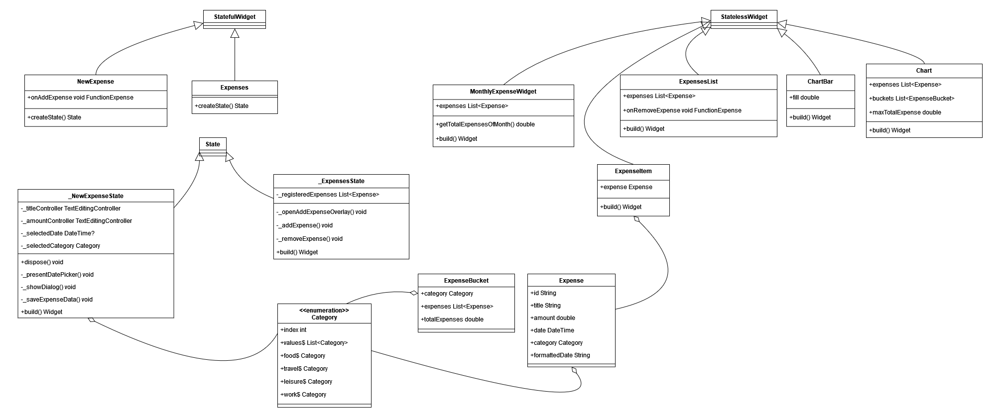

# Expense tracker

Simple expense tracker app. This project is assignment 1 in [IDATA2503 - Mobile applications](https://www.ntnu.edu/studies/courses/IDATA2503) course at NTNU. Below is the documentation required for the assignment.  

## App architecture
Application consists of one screen, ExpenseScreen. This screen is a stateful widget and it is the owner of the expense data. It is also the SSOT (single source of truth). This means that this widget is responsible for carrying  out operations on the expenses data (creating, deleting, updating/replacing), as well as showing it to the user, using other widgets in the widget tree. Expenses are displayed in a scrollable list of expenses, and above there is a simple chart showing amounts in different expense categories in relation to each other.  

## User stories
 - As a user, I want add an expense to the application, so it is saved in an organized manner.  
 - As a user, I want to be able to delete an expense from the application, so it can be removed if it was irrelevant.  
 - As a user, I wan to see a chart of different expense type amounts, so I can find out what kinds of things I spend the most money on.  
 - As a user, I want to edit existing expenses, so in case of a mistake I can fix it.  
 - As a user, I want to be able to undo a delete operation, so I don't lose my expenses by accident.  
 
## Specifications
### Expense summary
User Interface:
- Bar Graph: Displays a bar graph representing the total expenses for each category (Food, Travel, Leisure, Work).
- Expense List: Shows a list of expenses entered by the user.
- Swipe-to-Delete: Allows the user to swipe left on an expense item to delete it.
- *Swipe-to-Edit: Allows the user to swipe right on an expense item to update it.* - **my extra feature**
- Undo Option: After deleting an expense, a message "Expense Deleted" appears at the bottom of the screen, along with an "Undo" button. The undo option is available for 5 seconds.
- Add Button: Located in the top-right corner and represented by a "+" icon. Opens the first screen to add a new expense.
- Undo Delete: Provides a brief window of time to undo the delete operation.
### New expense 
- Title Text Box: Allows the user to input the title of the expense.
- Amount Text Box: Contains a currency icon (Dolla) followed by a text box for entering the expense amount.
- Calendar Icon: Located to the right of the amount text box to select a date.
- Category Dropdown: A dropdown menu with options (Food, Travel, Leisure, Work) and "Food" pre-selected.
- Save Button: Saves the entered expense.
- Cancel Button: Cancels the expense entry.

## File and folder structure
`main.dart` is the entry point of the application. it calls Flutter's  `runApp` and passes `ExpsnesTrackerApp` as argument.  
`expense_tracker_app.dart` contains `ExpenseTrackerApp`, which has the `MaterialApp`, it takes care of the themes and general settings, and finally it shows the `ExpensesScreen`.  
`ExpensesScreen` is located in `expense_screen.dart`.  It is responsible for expenses data, as well as displaying the chart (located in the chart folder, files are taken directly from Udemy course) and `ExpensesList`, which is located in `expenses_list.dart`.
`ExpensesList` is a list of dismissible items, each one is an `ExpenseItem`, defined in `expense_item.dart`.  
`ExpenseScreen` is also responsible for showing a modal bottom sheet, which displays a widget defined in` new_expense.dart`.
In the models folder, there is `expense.dart` which contains the `Expense` class and `ExpenseBucket` class (needed for charts).

## Class diagram
